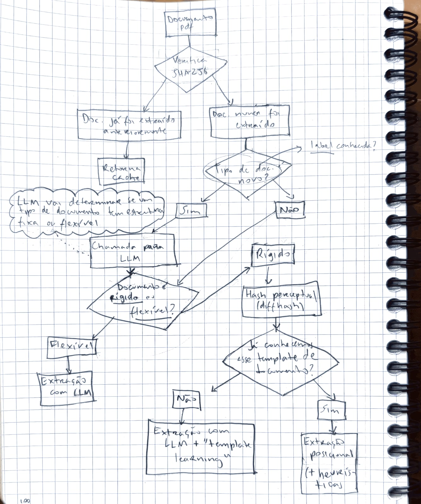
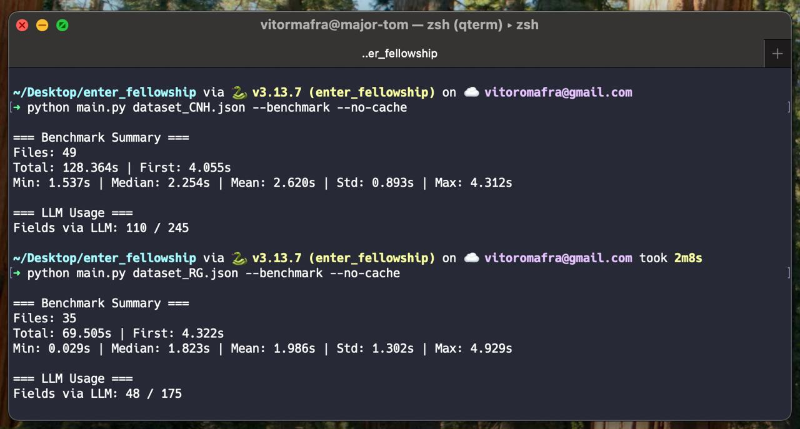

# Enter AI Fellowship - Take Home Project

**Extração de informação de documentos** se tornou trivial com LLMs. O verdadeiro desafio agora é fazer isso **de forma barata, rápida e eficiente**. Este projeto é uma tentativa de seguir nessa direção: transformar a extração de documentos em um processo adaptativo, que começa de mãos dadas com os modelos de linguagem, mas depois aprende a seguir sozinho de maneira muito mais ágil e econômica.

Roubando o poder de extrapolação dos modelos de linguagem, o sistema aprende com cada interação. Com uma combinação de hashing perceptual, heurísticas espaciais e aprendizado incremental, ele reconhece automaticamente quando um documento pertence a um template já conhecido e realiza a extração de forma autônoma. Assim, os LLMs só são acionados em casos totalmente novos ou ambíguos, enquanto o pipeline se torna cada vez mais rápido, preciso e barato, reduzindo custos, latência e dependência de inferência externa a cada nova execução. Cada novo documento fortalece esse processo.



### Instalação

Pré‑requisitos:
- macOS/Linux com bash/zsh (comandos abaixo)

Passo a passo:

```bash
# 1) Instale o uv (se ainda não tiver)
curl -LsSf https://astral.sh/uv/install.sh | sh

# 2) No diretório do projeto, crie e ative o ambiente 3.13
uv venv -p 3.13
source .venv/bin/activate  # zsh/bash

# 3) Instale dependências com uv
uv pip install -r requirements.txt

# 4) Configure sua API key da OpenAI
export OPENAI_API_KEY="sua_chave"
# (opcional) ou use um .env:
echo "OPENAI_API_KEY=sua_chave" > .env
```

#### TL;DR

```bash
uv venv -p 3.13 && source .venv/bin/activate
uv pip install -r requirements.txt
export OPENAI_API_KEY="sua_chave"
python main.py dataset.json
```

### Como usar

```bash
# Execução básica (serial)
python main.py dataset.json

# Saída verbosa
python main.py dataset.json -v

# Paralelizar por label
python main.py dataset.json --parallel

# Medir tempos/uso de LLM e imprimir resumo
python main.py dataset.json --benchmark

# Desativar cache de resultados
python main.py dataset.json --no-cache

# Note que essas opções podem ser combinadas, como em
python main.py dataset.json --no-cache --parallel --benchmark
```

Saídas:
- Arquivo por PDF em `results/<nome_arquivo>.json` (apenas os campos do schema)
- Consolidação incremental em `results/output.json`

### Formato de entrada (dataset.json)

```json
[
  {
    "label": "carteira_oab",
    "extraction_schema": {
      "nome": "Nome do profissional",
      "inscricao": "Número de inscrição",
      "situacao": "Situação do profissional"
    },
    "pdf_path": "files/oab_1.pdf"
  }
]
```

#### Formato de saída (para cada PDF)

```json
{
  "nome": "MARIA SILVA",
  "inscricao": "123456",
  "situacao": "Ativo"
}
```

### Resultados

```

```


### Estrutura do projeto

```
enter_fellowship/
├── box_parser.py                 # Segmenta caixas multi-campos e casa segmentos com campos
├── cache.py                      # Cache de resultados + versionamento de código
├── classification.py             # Classificação rígida/flexível via LLM (com cache por label)
├── evaluator.py                  # Avaliação de acurácia (results vs oracle_results)
├── extraction.py                 # Extração de texto com/sem coordenadas (PyMuPDF)
├── format_validator.py           # Inferência/validação de formatos e extração de substrings válidas
├── hashing.py                    # Hash perceptual estável (full/left/right) e matching de template
├── heuristics.py                 # Matching posicional com pontuação composta e truncamentos defensivos
├── llm_utils.py                  # Cliente OpenAI e utilitários de classificação/extração via LLM
├── main.py                       # CLI (parâmetros, logging, delega ao pipeline)
├── oracle.py                     # Extração via LLM + criação/uso de templates em memória
├── pipeline.py                   # Orquestração: cache → classificação → extração → salvamento/benchmark
├── requirements.txt
├── README.md
├── .gitignore
├── templates/
│   └── templates.json           # Conhecimento persistente por label (gerado/atualizado em runtime)
├── results/                     # Saídas por PDF e output.json (gerados em runtime)
│   └── *.json
├── oracle_results/              # Gabaritos para avaliação (opcional)
│   └── *.json
├── files/                       # Exemplos pequenos de PDFs para teste rápido
│   └── *.pdf
├── dataset*.json               # Datasets de entrada (ex.: dataset.json, dataset_RG.json, ...)
├── dataset_CNH/                 # PDFs grandes (ignorados no Git)
├── dataset_RG/                  # PDFs grandes (ignorados no Git)
└── dataset_compras_BNDES/       # PDFs grandes (ignorados no Git)
```


### Custo x acurácia (resumo da estratégia)
- Classificação por label com cache (minimiza chamadas ao LLM).
- Hashing perceptual multi‑região + templates em memória para reuso imediato.
- Heurísticas posicionais e parsing de caixas multi‑campos antes do LLM.
- LLM apenas para campos faltantes/invalidáveis (incremental) e para documentos flexíveis.
- Conhecimento persistente por `label+campos` em `templates/templates.json` (tipos, comprimentos, padrões, delimitadores).
- Cache de resultados em `results/`.

### Boas práticas e notas importantes
- O sistema tenta sempre heurísticas posicionais antes de recorrer ao LLM e chama o LLM apenas para campos faltantes/invalidáveis.
- Templates por hash vivem na memória durante a execução; o conhecimento agregado por `label` persiste em `templates/templates.json`.
- O cache invalida automaticamente quando PDFs mudam ou quando a versão do código de extração se altera.

### Troubleshooting
- Erro de API: verifique `OPENAI_API_KEY` e conectividade; use `-v` para logs. Sem `-v` nada nunca será impresso (otimização para os benchmarks).
- Erros com PyMuPDF: cheque instalação do `pymupdf` e permissões de leitura do PDF.
- Sem resultados em `results/`: confirme caminhos do `dataset.json` e existência dos arquivos.

### Avaliação de acurácia (opcional)

```bash
python evaluator.py
```
Compara `results/*.json` com os gabaritos em `oracle_results/*.json` e imprime um resumo de acurácia geral/por arquivo/campo. Para gerar o output do oráculo, também usei o Chat GPT 5 mini.
